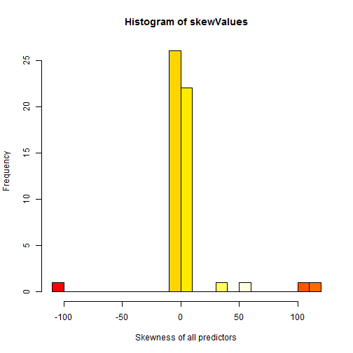

PML - Programming Assignment
========================================================

This Coursera course teaches us about Practical Machine Learning with R.
We get a good knowledge about various Machine Learning algorithms and useful R packages to made a Data Scientist's day more comfortable. This assessment should show what we have learned so far.

# Abstract
---------------

Quantified Self movement is currently a new trend to improve personal or professional productivity in health and wellness. As discribed in Wikipedia, people have abelities to track physical activity, caloric intake, sleep quality, posture, and other factors involved in personal well-being.
To measure themselves various sensors will be used to collect specific data.

Our goal for this assignment will be to use data from accelerometers on the belt, forearm, arm, and dumbell of 6 participants. They were asked to perform barbell lifts correctly and incorrectly in 5 different ways. More information is available from the website here: http://groupware.les.inf.puc-rio.br/har (see the section on the Weight Lifting Exercise Dataset).

To accomplish this assignment we have to predict the manner in which they did the exercise. This is the "classe" variable in the training set.

### Important points are:

* how we used cross validation
* what is the expected out of sample error
* why we made the choices you did
* predict 20 given different test cases
* a good accuracy

### Minor points are:

* performance
* scalability

I have devided my approach into different steps. I will subscribe each step as good as i can.

## Requirements
Load all necessary libraries used for this project

```r
library(caret)
```

```
## Loading required package: lattice
## Loading required package: ggplot2
```

```r
library(randomForest)
```

```
## randomForest 4.6-7
## Type rfNews() to see new features/changes/bug fixes.
```

```r
library(e1071)
library(doParallel)
```

```
## Loading required package: foreach
## Loading required package: iterators
## Loading required package: parallel
```

## Step 1: Loading data
Load the data sets and replace unuseful strings with NAs.

```r
trainRawData <- read.csv("data/pml-training.csv", na.strings=c("NA","", "#DIV/0!"))
testingRawData <- read.csv("data/pml-testing.csv", na.strings=c("NA","", "#DIV/0!"))
```

## Step 2: Cleaning up the data

Find columns with NAs set and remove them. This will remove columns which could be imputed too.
I made this as a comromise to speed things up.

```r
set.seed(1972)
cleanedData <- trainRawData[ ,colSums(is.na(trainRawData)) == 0]
testing <- testingRawData[ ,colSums(is.na(trainRawData)) == 0]
```

Create a training and cross validation set as shown in the videos.
So we get 70% out of the data for training and 30% for crossvalidation

```r
trainIndex <- createDataPartition(y = cleanedData$classe, p=0.7, list=FALSE) # 3927 rows
training <- cleanedData[trainIndex,]
cross <- cleanedData[-trainIndex,]
```

Discard unuseful predictors because they are not numeric.

```r
columnsToRemove <- names(training) %in% c("raw_timestamp_part_1", "raw_timestamp_part_2", "cvtd_timestamp", "X", "user_name", "new_window")
training <- training[ , !columnsToRemove]
cross <- cross[ , !columnsToRemove]
testing <- testing[, !columnsToRemove]
```

The cleanup step gaves us 53 predictors to work with.

### Skewness
Lets have a look at the skewness of the data. To find it out we use the skewness function of the 'e1071' package.

```r
# check data for skewness
classeName <- names(training) %in% c("classe") 
testForSkewness <- training[!classeName]
# apply the skewnes function to each numeric column of our training set
skewValues <- apply(testForSkewness, 2, skewness)
# create a data frame for fancier printing
skewValuesDf <- data.frame(skewValues)
print(skewValuesDf)
```

```
##                      skewValues
## num_window            2.310e-02
## roll_belt            -2.050e-03
## pitch_belt           -9.953e-01
## yaw_belt              9.106e-01
## total_accel_belt      4.702e-02
## gyros_belt_x         -5.977e-01
## gyros_belt_y         -6.394e-02
## gyros_belt_z          2.113e-01
## accel_belt_x          9.646e-01
## accel_belt_y          1.767e-01
## accel_belt_z          6.569e-03
## magnet_belt_x         1.429e+00
## magnet_belt_y        -2.229e+00
## magnet_belt_z         2.631e-01
## roll_arm             -1.816e-01
## pitch_arm             1.956e-01
## yaw_arm              -8.960e-02
## total_accel_arm       7.324e-02
## gyros_arm_x          -2.953e-01
## gyros_arm_y           1.179e-01
## gyros_arm_z          -1.644e-01
## accel_arm_x           3.521e-01
## accel_arm_y           8.161e-02
## accel_arm_z          -8.565e-01
## magnet_arm_x         -1.513e-01
## magnet_arm_y         -4.653e-01
## magnet_arm_z         -1.146e+00
## roll_dumbbell        -7.509e-01
## pitch_dumbbell        5.359e-01
## yaw_dumbbell          2.237e-01
## total_accel_dumbbell  5.896e-01
## gyros_dumbbell_x     -1.089e+02
## gyros_dumbbell_y      3.587e+01
## gyros_dumbbell_z      1.148e+02
## accel_dumbbell_x     -4.547e-01
## accel_dumbbell_y      3.438e-01
## accel_dumbbell_z     -7.782e-02
## magnet_dumbbell_x     1.714e+00
## magnet_dumbbell_y    -1.862e+00
## magnet_dumbbell_z     8.682e-01
## roll_forearm         -4.631e-01
## pitch_forearm        -5.278e-01
## yaw_forearm          -2.664e-01
## total_accel_forearm  -5.693e-01
## gyros_forearm_x      -2.683e+00
## gyros_forearm_y       5.417e+01
## gyros_forearm_z       1.024e+02
## accel_forearm_x      -2.375e-01
## accel_forearm_y      -6.435e-01
## accel_forearm_z       4.371e-01
## magnet_forearm_x      6.327e-01
## magnet_forearm_y     -7.478e-01
## magnet_forearm_z     -1.216e+00
```

```r
# plot a histogram of the skewness.
hist(skewValues, col=heat.colors(17), xlab="Skewness of all predictors", breaks=20)
```

 

As you can see we have left-skewness and also right-skewness in our data set. So we need some pre-processing prior to fit our model.
This step will be done directly in the preProcess step of caret's train function.

## Step 3 Model creation

I've trained a Random Forest with 10 K-Folds cross validation partitions in the train control parameter to accomplish this ask.
There was a pre processing step added to normalize the data because it's are skewed as showed above. I've used center and scale to normalize it.

### Build a Random Forest (RF)

#### Advantages of RF:
* very simple to use even with default settings
* produces mostly results with good accuracy without special tuning parameters
* robust
* fast
* can handle larger problems before slowing

#### Disadvantages of RF
* difficult to interpret

Further i've used the doParallel package to speed things up little bit


```r
# Create clusters for all available cores communicating over sockets
cl <- makeCluster(detectCores() / 2)
registerDoParallel(cl)

# global settings used for for all models
#ctrl <- trainControl(method='cv', number=10, savePred=T, classProb=T, verboseIter=T)
ctrl <- trainControl(method='cv', number=10, allowParallel=TRUE)
```

Build a fitted Random Forest model with normalization, and 10-Fold cross vaidation


```r
modFitRf <- train(training$classe ~.,
                data = training,
                do.trace=100,
                method="rf",
                trControl=ctrl,
                preProcess=(method=c("center", "scale")))
```

```
## ntree      OOB      1      2      3      4      5
##   100:   0.26%  0.03%  0.53%  0.25%  0.40%  0.24%
##   200:   0.25%  0.05%  0.53%  0.25%  0.36%  0.20%
##   300:   0.25%  0.05%  0.45%  0.25%  0.36%  0.24%
##   400:   0.23%  0.05%  0.41%  0.25%  0.31%  0.24%
##   500:   0.24%  0.05%  0.38%  0.33%  0.31%  0.24%
```

## Results

### Out of Sample accuracy, Random Forest

Now let's take a look at our generated model and it's statistics which looks like as follows:


```r
print(modFitRf)
```

```
## Random Forest 
## 
## 13737 samples
##    53 predictors
##     5 classes: 'A', 'B', 'C', 'D', 'E' 
## 
## Pre-processing: centered, scaled 
## Resampling: Cross-Validated (10 fold) 
## 
## Summary of sample sizes: 12362, 12364, 12363, 12363, 12364, 12363, ... 
## 
## Resampling results across tuning parameters:
## 
##   mtry  Accuracy  Kappa  Accuracy SD  Kappa SD
##   2     1         1      0.003        0.003   
##   30    1         1      0.002        0.002   
##   50    1         1      0.002        0.003   
## 
## Accuracy was used to select the optimal model using  the largest value.
## The final value used for the model was mtry = 27.
```

```r
print(modFitRf$finalModel)
```

```
## 
## Call:
##  randomForest(x = x, y = y, mtry = param$mtry, do.trace = 100) 
##                Type of random forest: classification
##                      Number of trees: 500
## No. of variables tried at each split: 27
## 
##         OOB estimate of  error rate: 0.24%
## Confusion matrix:
##      A    B    C    D    E class.error
## A 3904    1    0    0    1    0.000512
## B    7 2648    3    0    0    0.003762
## C    0    8 2388    0    0    0.003339
## D    0    0    6 2245    1    0.003108
## E    0    1    0    5 2519    0.002376
```

As you can see the OOB error is ~0.25%. This is a good result.

Predict against our cross validation set created in step 2 to find out the accuracy of our model.

```r
predCrossRf <- predict(modFitRf, cross)
print(confusionMatrix(predCrossRf, cross$classe))
```

```
## Confusion Matrix and Statistics
## 
##           Reference
## Prediction    A    B    C    D    E
##          A 1674    1    0    0    0
##          B    0 1137    6    0    0
##          C    0    1 1020    5    0
##          D    0    0    0  959    0
##          E    0    0    0    0 1082
## 
## Overall Statistics
##                                         
##                Accuracy : 0.998         
##                  95% CI : (0.996, 0.999)
##     No Information Rate : 0.284         
##     P-Value [Acc > NIR] : <2e-16        
##                                         
##                   Kappa : 0.997         
##  Mcnemar's Test P-Value : NA            
## 
## Statistics by Class:
## 
##                      Class: A Class: B Class: C Class: D Class: E
## Sensitivity             1.000    0.998    0.994    0.995    1.000
## Specificity             1.000    0.999    0.999    1.000    1.000
## Pos Pred Value          0.999    0.995    0.994    1.000    1.000
## Neg Pred Value          1.000    1.000    0.999    0.999    1.000
## Prevalence              0.284    0.194    0.174    0.164    0.184
## Detection Rate          0.284    0.193    0.173    0.163    0.184
## Detection Prevalence    0.285    0.194    0.174    0.163    0.184
## Balanced Accuracy       1.000    0.998    0.996    0.997    1.000
```

The confusionMatrix shows us that we have an accuracy of 99.8% with our cross validation set, This is a pretty good result that fits our needs.

The accuracy is good enough to predict the test data set against our Random Forest model.


Print the overall agreement and Kappa:

```r
accuracySummary <- postResample(predCrossRf, cross$classe)
print(accuracySummary)
```

```
## Accuracy    Kappa 
##   0.9978   0.9972
```


## Step 4: Submitted prediction results on the supplied test set 

This is my final result of the prediction that i submitted with my 53 predictors:

```r
predRf <- predict(modFitRf, testing)
print(predRf)
```

```
##  [1] B A B A A E D B A A B C B A E E A B B B
## Levels: A B C D E
```

```r
# stop all created cluster nodes
stopCluster(cl)
```

## FInal words

I tried to train a Polymomial SVM too, so i can compare two models to each other. Unfortunately it runs a couple of hours and it was not possible for me to build this final document with both models trained via knitr again and again.
It tooks me many, many time to accomplish this task nevertheless i had a lot of fun to play with ML technology.

## References

[1]: http://groupware.les.inf.puc-rio.br/har, Data sets for Human Activity Recognition

[2]: Albert A. Montillo, Ph.D., Guest lecture: Statistical Foundations of Data Analysis
Temple University 4-2-2009, http://www.dabi.temple.edu/~hbling/8590.002/Montillo_RandomForests_4-2-2009.pdf

[3]: Velloso, E.; Bulling, A.; Gellersen, H.; Ugulino, W.; Fuks, H. Qualitative Activity Recognition of Weight Lifting Exercises. Proceedings of 4th International Conference in Cooperation with SIGCHI (Augmented Human '13) . Stuttgart, Germany: ACM SIGCHI, 2013.

[4]: Kuhn, M.; Johnson, K. Applied Predictive Modeing, Springer 2013
